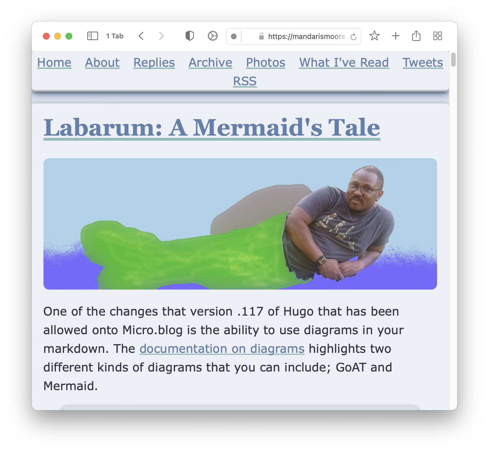
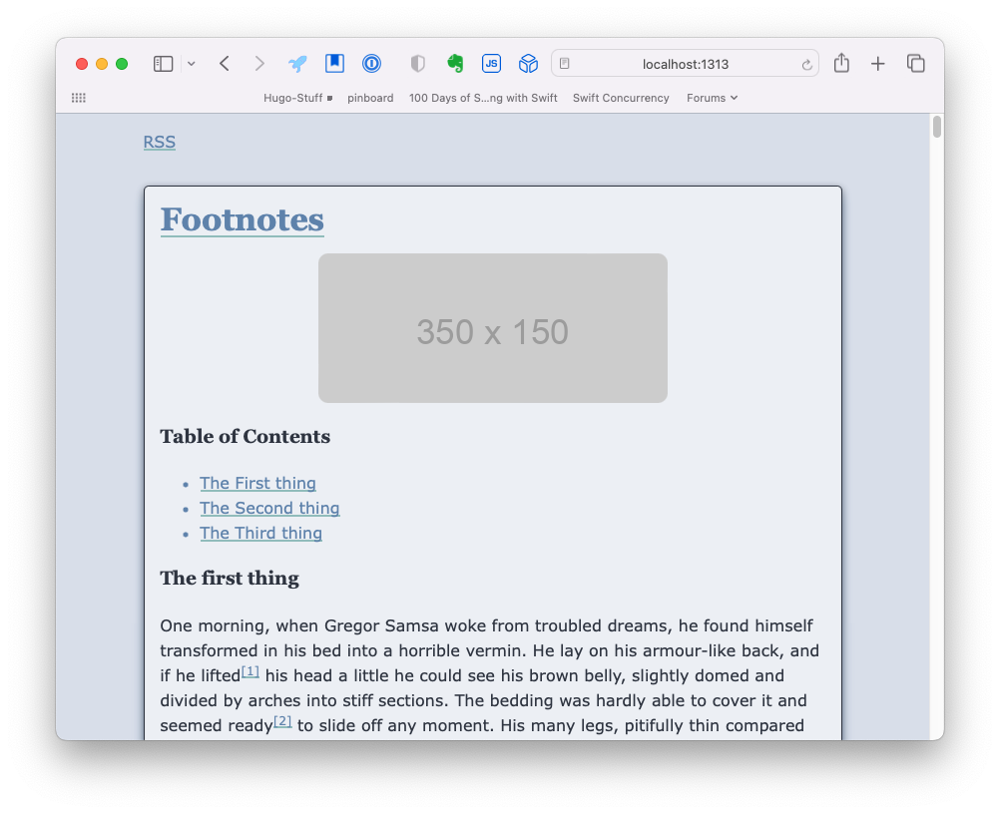
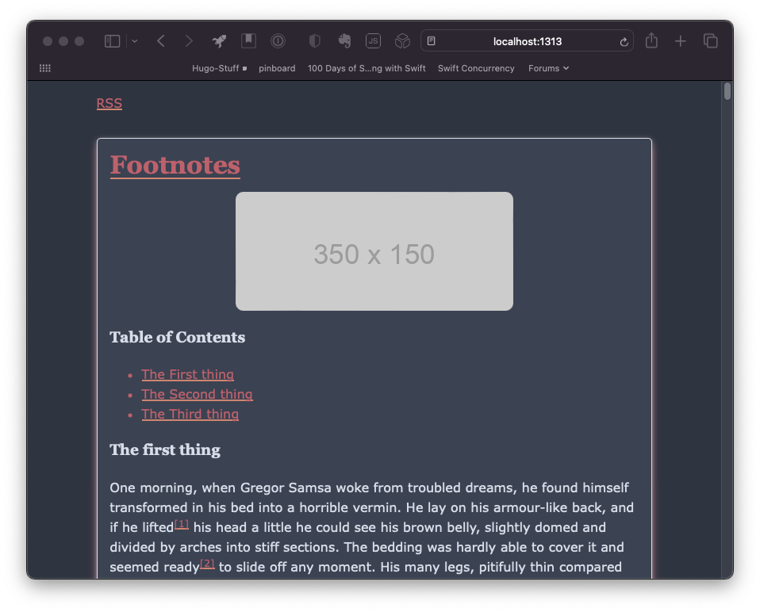
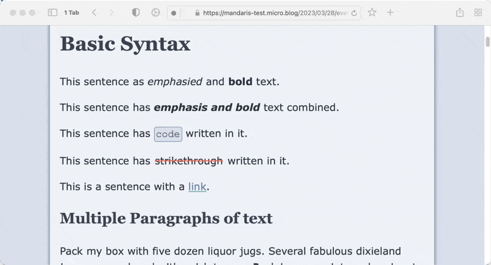
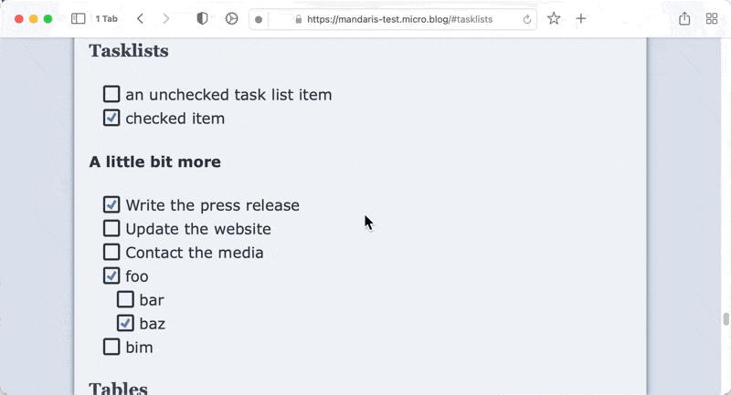

# Labarum
A Hugo/Micro.blog theme based on html and schema tags.

I created this to learn more about Micro.blog and hugo and I'm pretty proud of it. It handles all of the basic Goldmark syntax and has both a light and dark mode. 

## Labarum has a light and dark mode.

## Basic syntax

## Block quotes

## Lists

## Task lists

## Table of Contents

The first one is activated by adding <code></code> to your text and will float in the center of the article.

The second one is activated by adding <code></code> to your text and will float in the right of the article. 

## Release notes
### v1.2.12
  * Adjust margins on for smaller viewports
  * Adjust lines and colors for `<del>`, `<ins>`, and `<s>`
  * Remove normalize.css
  * Move styling from elements to classes
  * Configure Goldmark parser to not wrap `` in `
` tags
  * Part one of CSS rewrite
  
### v1.2.11
  * Add styling to comments
  
### v1.2.10
  * Add css for `
`
  * Change default image for `og:image` and `itemprop="image"`
  * Move meta `wordCount` to article
  * Become displeased with how version numbers work
  
### v1.2.9
  * Remove bottom border in photos page
  * Adjust spacing in books page
  * Make author information more responsive
  * Remove border radius on blockquote
  
### v1.2.8
  * Accessibility improvements using [WAVE](https://wave.webaim.org "WAVE Web Accessibility Evaluation Tools") to test 
  * Validation improvements to schema tags. Using https://validator.w3.org/nu/ as the tool to validate
  
### v1.2.7
  * Enable [Mermaid.js](https://mermaid.js.org/)
  * Set the version in the `config.json` file
  * Reformat README.md
  * Remove `role="contentinfo"` from author `<aside>`
  * Minor accessibility and validation changes

### v1.2.5

  * Adjustments to the README
  * Turn on Profile information at the bottom of the site

### v1.2.0
  * Rewritten Code blocks  
    * Wrote about the change on [my blog](https://mandarismoore.com/2023/09/22/labarum-code-blocks.html). Incorporated a significant amount of work to understand the Hugo system
  * Table of Contents short codes
  * Moved to Micro.blog standard head

### v1.1.4

  * Create parameters `showDebugInfo` & `showAuthorInfo`
  * Defaults to `false`
  * The information is rendered into the page but is hidden using `display:none` in inline style.
  * Can be toggled on or off in plugin settings.
  * Adjustments in different aspect of the theme to prepare to moving to [CUBE CSS](https://cube.fyi)
  * Modifications to tables
  * Using `min-width` and `margin: auto` for centering the table to the container and making use of the space that is available.
  * Modifications to code blocks
  * An update in rendering added more styling.
  * Removed increased padding on links as part of a:hover
  * Added styling for `<s>`
  * This was previously overlooked as it was thought to be the same as `<del>`
  * Update the README.md