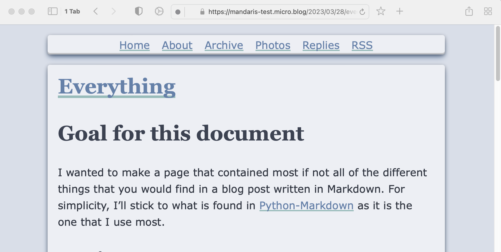

# Labarum
A Hugo/Micro.blog theme based on html and schema tags.

I created this to learn more about Micro.blog and hugo and I'm pretty proud of it. It handles all of the basic Goldmark syntax and has both a light and dark mode. 

## Labarum has a light and dark mode.

## Basic syntax

## block quotes

## lists

## tasks lists

## Release notes

### v1.1.4

* Create parameters `showDebugInfo` & `showAuthorInfo`
    * Defaults to `false`
    * The information is rendered into the page but is hidden using `display:none` in inline style.
    * Can be toggled on or off in plugin settings.

* Adjustments in different aspect of the theme to prepare to moving to [CUBE CSS](https://cube.fyi)

* Modifications to tables
	* Using `min-width` and `margin: auto` for centering the table to the container and making use of the space that is available.
	
* Modifications to code blocks
	* An update in rendering added more styling.

* Removed increased padding on links as part of a:hover

* Added styling for `<s>`
	* This was previously overlooked as it was thought to be the same as `<del>`.

* Update the README.md