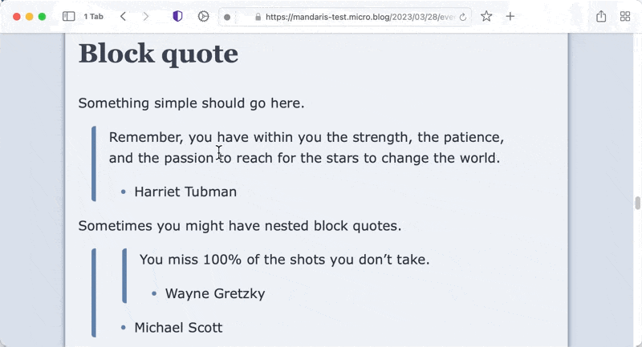

# Labarum
A Hugo/Micro.blog theme based on html and schema tags.

I created this to learn more about Micro.blog and hugo and I'm pretty proud of it. It handles all of the basic Goldmark syntax and has both a light and dark mode. 

## Labarum has a light and dark mode.

## Basic syntax

## Block quotes

## Lists

## Task lists

## Table of Contents

The first one is activated by adding <code></code> to your text and will float in the center of the article.

The second one is activated by adding <code></code> to your text and will float in the right of the article. 

## Release notes
### v1.3.07
  * Add partials for [upcoming mathematics support in Hugo](https://gohugo.io/content-management/mathematics/ "Mathematics in Markdown"). This has been defaulted to `false` until v0.122 is available.
  * Use [Modern Font Stacks](https://modernfontstacks.com). [Matt Langford](https://www.mattlangford.com/) discussed this on the [Tiny Theme page on fonts](https://tiny.micro.blog/2024/03/01/changing-fonts.html). I really liked his implementation and you should check it out!

### v1.3.06
  * Change the `li` marker color to `--text-alt` in order to match header color
  * Change padding of `body` to utilize more space
  * add `text-shadow` to `a.no-decoration` 
  * Change logic for the debug flags
  * Create stub for theme example
  * temporarily add the `rsvp` shortcode 
  
### v1.3.05
  * Improve `h*` tags by changing color to `--text-alt`
  * Make changes to `text-decoration` inspired by [12 Modern CSS One-Line Upgrades](https://moderncss.dev/12-modern-css-one-line-upgrades/#text-underline-offset) to various elements
  * Turn on debugging by default temporarily
  * Modify cursor on `<abbr>`
  * Adjust `line-height` to make `sub`, `sup`, and `ruby` elements less obtrusive
  * Add `accent-color` to `root` of CSS

### v1.3.04
  * Move the 404 page to proper location according to [documentation](https://help.micro.blog/t/custom-404-page/73)

### v1.3.03
  * Use `article.html` in `list.html`

### v1.3.02
  * Add masonry to `photos-grid-container`
  
### v1.3.01
  * Add style to `<abbr>`
  * Remove some whitespace around optional components
  
### v1.3.00
  * Add styling to .archive_category class from baseline
  * Adjust `text-decoration-color` and `text-decoration-thickness` on `ins`, `del`, and `s` elements
  * Add `a.no-decoration` to style and pagination
  * Hide empty optional and custom `
`s if they are empty
  * Toggle the generation of debug output based on a parameter
  
### v1.2.20
  * Shrink and float avatars
  * Make white space in css more consistent
  * Fix for warning about isset
  
### v1.2.19
  * Center contents of custom footer
  * Add padding to top and bottom of optional boxes
  
### v1.2.18
  * Revert change of mastodon logic
  
### v1.2.17
  * Copied code from [Tiny Theme]() to implement optional plugins for micro.blog
  * Changed tabs to spaces in project
  * Added additional schema tags to headers and urls
  * Added styling for custom footer
  
### v1.2.16
  * Update link to mastodon account
  
### v1.2.15
  * Move link to outside of headers
  * Add `u-url` class and `rel="me"` to link found in author footer
  * Make changes for mastodon account conditional of username
  * Make categories conditional
  
### v1.2.14
  * Revert to use `{{ .Site.Author.avatar }}` for OpenGraph images
  
### v1.2.13
  * Adjust margin on avatar images
  * Add mastodon username and server to head
  
### v1.2.12
  * Adjust margins on for smaller viewports
  * Adjust lines and colors for `<del>`, `<ins>`, and `<s>`
  * Remove normalize.css
  * Move styling from elements to classes
  * Configure Goldmark parser to not wrap `` in `
` tags
  * Part one of CSS rewrite
  
### v1.2.11
  * Add styling to comments
  
### v1.2.10
  * Add css for `
`
  * Change default image for `og:image` and `itemprop="image"`
  * Move meta `wordCount` to article
  * Become displeased with how version numbers work
  
### v1.2.9
  * Remove bottom border in photos page
  * Adjust spacing in books page
  * Make author information more responsive
  * Remove border radius on blockquote
  
### v1.2.8
  * Accessibility improvements using [WAVE](https://wave.webaim.org "WAVE Web Accessibility Evaluation Tools") to test 
  * Validation improvements to schema tags. Using https://validator.w3.org/nu/ as the tool to validate
  
### v1.2.7
  * Enable [Mermaid.js](https://mermaid.js.org/)
  * Set the version in the `config.json` file
  * Reformat README.md
  * Remove `role="contentinfo"` from author `<aside>`
  * Minor accessibility and validation changes

### v1.2.5

  * Adjustments to the README
  * Turn on Profile information at the bottom of the site

### v1.2.0
  * Rewritten Code blocks  
    * Wrote about the change on [my blog](https://mandarismoore.com/2023/09/22/labarum-code-blocks.html). Incorporated a significant amount of work to understand the Hugo system
  * Table of Contents short codes
  * Moved to Micro.blog standard head

### v1.1.4

  * Create parameters `showDebugInfo` & `showAuthorInfo`
  * Defaults to `false`
  * The information is rendered into the page but is hidden using `display:none` in inline style.
  * Can be toggled on or off in plugin settings.
  * Adjustments in different aspect of the theme to prepare to moving to [CUBE CSS](https://cube.fyi)
  * Modifications to tables
  * Using `min-width` and `margin: auto` for centering the table to the container and making use of the space that is available.
  * Modifications to code blocks
  * An update in rendering added more styling.
  * Removed increased padding on links as part of a:hover
  * Added styling for `<s>`
  * This was previously overlooked as it was thought to be the same as `<del>`
  * Update the README.md