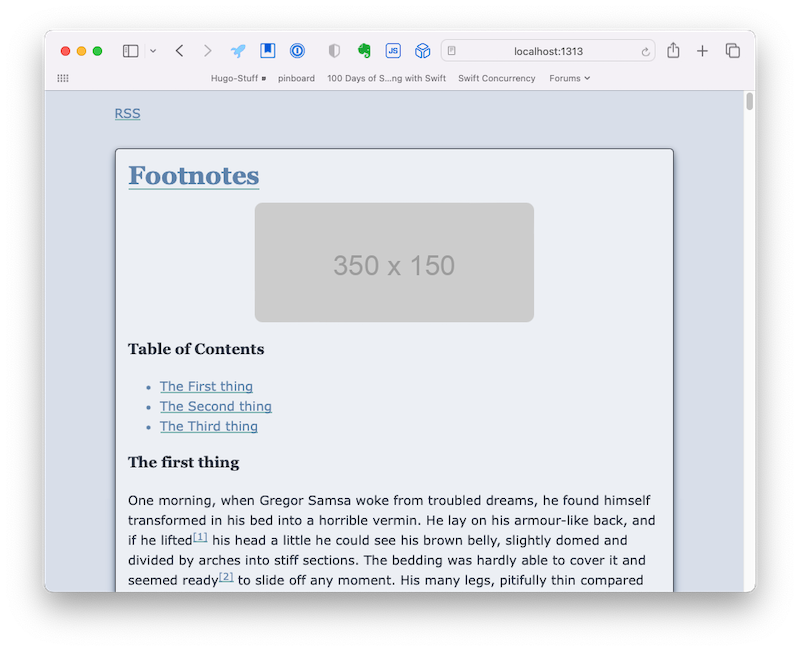

# Labarum
A Hugo/Micro.blog theme based on html and schema tags.

I created this to learn more about Micro.blog and hugo and I'm pretty proud of it. It handles all of the basic Goldmark syntax and has both a light and dark mode. 

## Release notes

### v1.1.4
* Create paramater "debugInfo"
    * Defaults to false